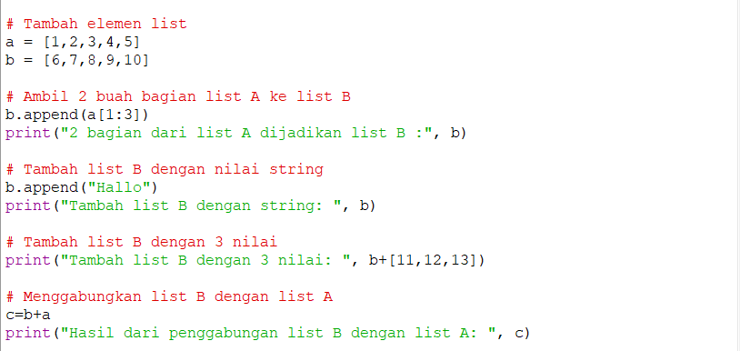
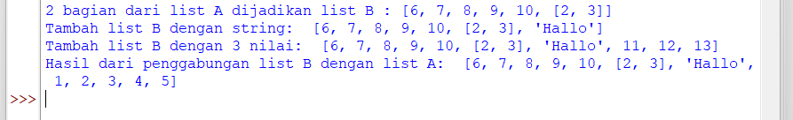
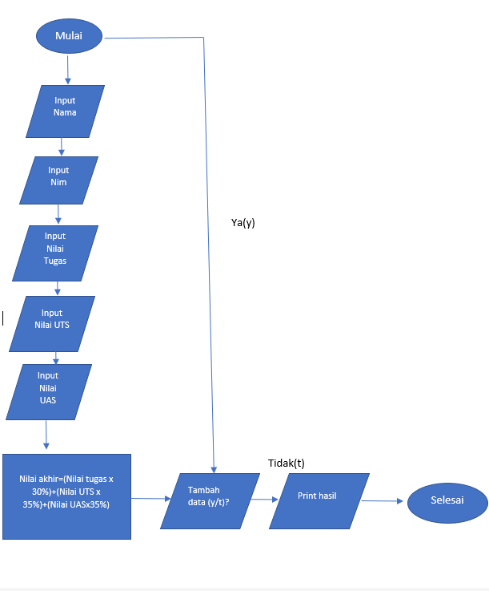
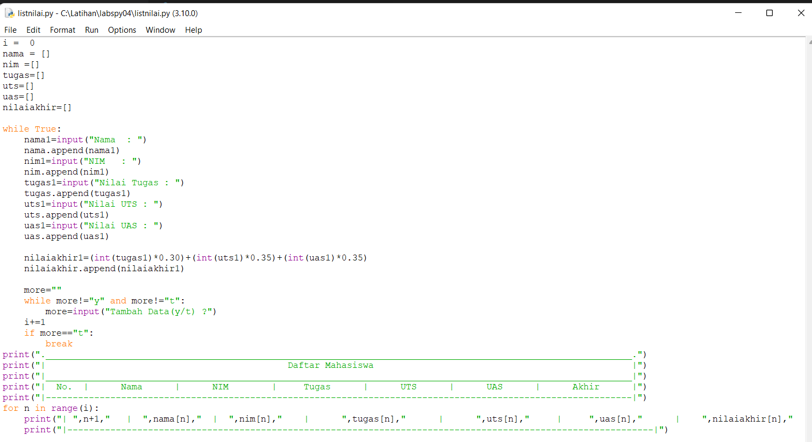
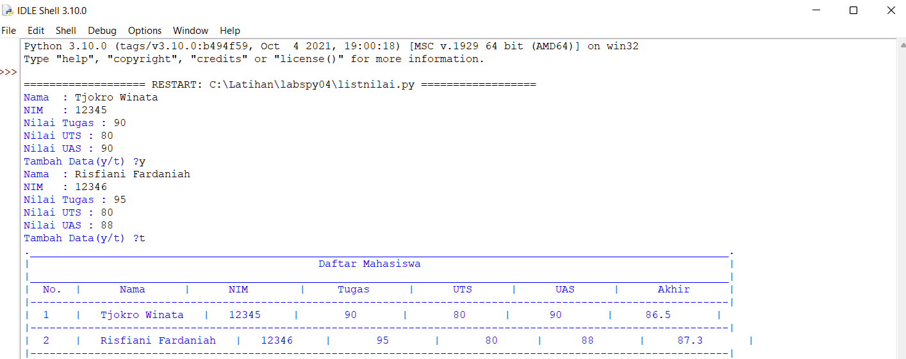

# BAHASA PEMOGRAMAN
# labspy04
## praktikum 4


### Latihan 1
### Buat List
- Jadi disini kita akan membuat list sebanyak 5 element dengan nilai bebas

#### Keterangan
- Di bawah ini merupakan list nya :
```python
daftar=["h","u","r","u","f"]
```
- Dan penjelasan mengenai perintah untuk menampilkan elemen ke3 ke dalam list , (karna elemen ke3 ada di indeks 2, maka harus menggunakan tanda [] / kurung siku)
```python
print ("Tampilkan elemen ke-tiga: ", list[2])
```
- Dan dibawah  ini adalah perintah untuk mengambil elemen ke2 - ke4 dengan indeks 1 - 4
```python
print ("Ambil nilai elemen ke2 sampai ke4: ", list[1:4])
```
- Dan yang ini merupakan perintah untuk mengambil elemen terakhir
```python
print ("Ambil elemen terakhir: ", list[-1])
```
### Ubah elemen list
#### Ubah elemen ke-4 dengan nilai lain 
- Dibawah ini merupakan perintah untuk merubah elemen ke-4
```python
list[3] = "k"
print ("Merubah elemen ke 4 dengan nilai lain: ", list)
```
#### Mengubah elemen ke-4 sampai akhir
- Perintah di bawah digunakan untuk mengubah elemen ke-4 sampai terakhir
```python
list[3:] = "a","h"
print ("Merubah elemen ke 4 sampai terakhir :", list)
```
#### Hasil dari program nya


#### Menambahkan elemen dalam list
- Dan berikut merupakan program nya :


- List nya :
```python
a = [1,2,3,4,5]
b = [6,7,8,9,10]
```
#### Mengambil 2 Bagian dari list A ke B
```python
b.append(a[1:3])
print("2 bagian dari list A dijadikan list B :", b)
```
- Diatas merupakan program untuk menambahkan list A ke dalam list B dengan menggunakan perintah append
#### Menambahkan list B dengan string
```python
b.append("Hallo")
print("Tambah list B dengan string: ", b)
```
- Program diatas digunakan untuk menambahkan list B dengan string menggunakan append
#### Menambahkan list B dengan 3 nilai
```python
print("Tambah list B dengan 3 nilai: ", b+[11,12,13])
```
- Di atas merupakan perintah untuk menambahkan list B dengan 3 nilai, Menggunakan aritmatika +
#### Menggabungkan list B dengan A
```python
c=b+a
print("Hasil dari penggabungan list B dengan list A: ", c)
```
- Di atas merupakan perintah untuk menggabungkan list B dengan A
#### Dan berikut hasil dari program nya:



## List Nilai Mahasiswa
### Berikut Merupakan Flowchart :


#### Berikut merupakan program nya:

#### Dengan keterangan
```python
i =  0 
nama = []
nim =[]
tugas=[]
uts=[]
uas=[]
nilaiakhir=[]
```
- Perintah di atas bertujuan untuk mendefinisikan list / daftar nya dan sekaligus untuk menampung data yang tersimpan

```python
    nama1=input("Nama  : ")
    nama.append(nama1)
    nim1=input("NIM   : ")
    nim.append(nim1)
    tugas1=input("Nilai Tugas : ")
    tugas.append(tugas1)
    uts1=input("Nilai UTS : ")
    uts.append(uts1)
    uas1=input("Nilai UAS : ")
    uas.append(uas1)
```
- Dan ini merupakan kode untuk memasukan isi ke dalam list tersebut, dan juga untuk menambahkan list jika sudah meng-input 1 nama atau nilai dalam daftar, dengan menggunakan append.

```python
    nilaiakhir1=(int(tugas1)*0.30)+(int(uts1)*0.35)+(int(uas1)*0.35)
    nilaiakhir.append(nilaiakhir1)
```
- Ini merupakan kode untuk menghitung nilai mahasiswa dengan penjelasan nilai akhir (30% dari tugas), ditambah (35% dari nilai UTS), dan (35% dari nilai UAS), Dengan kemudian diubah menjadi bentuk desimal dan selanjutnya dimasukan ke nilai sebelum akhirnya di cetak

```python
    more=""
    while more!="y" and more!="t":
        more=input("Tambah Data(y/t) ?")
    i+=1
    if more=="t":
        break
```
- Dan diatas merupakan program untuk memasukan pertanyaan apakah dengan nilai tersebut mahasiswa dapat dinyatakan dengan (ya/tidak). jika jawaban nya ya ketik (y) dan jika jawaban nya tidak dapat diketik (t). Maka dapat ditampilkan hasil nilai yang di inputkan.

#### Dan berikut hasil dari program nya


## Sekian dari saya
# TERIMA KASIH