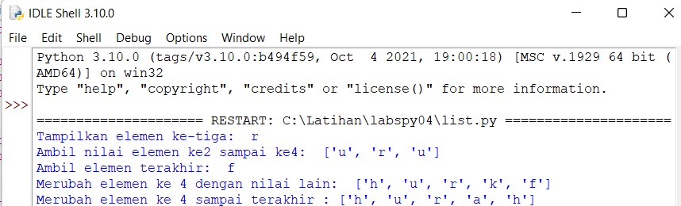

# BAHASA PEMOGRAMAN
# labspy04
## praktikum 4


### Latihan 1
### Buat List
- Jadi disini kita akan membuat list sebanyak 5 element dengan nilai bebas

#### Keterangan
- Di bawah ini merupakan list nya :
```python
daftar=["h","u","r","u","f"]
```
- Dan penjelasan mengenai perintah untuk menampilkan elemen ke3 ke dalam list , (karna elemen ke3 ada di indeks 2, maka harus menggunakan tanda [] / kurung siku)
```python
print ("Tampilkan elemen ke-tiga: ", list[2])
```
- Dan dibawah  ini adalah perintah untuk mengambil elemen ke2 - ke4 dengan indeks 1 - 4
```python
print ("Ambil nilai elemen ke2 sampai ke4: ", list[1:4])
```
- Dan yang ini merupakan perintah untuk mengambil elemen terakhir
```python
print ("Ambil elemen terakhir: ", list[-1])
```
### Ubah elemen list
#### Ubah elemen ke-4 dengan nilai lain 
- Dibawah ini merupakan perintah untuk merubah elemen ke-4
```python
list[3] = "k"
print ("Merubah elemen ke 4 dengan nilai lain: ", list)
```
#### Mengubah elemen ke-4 sampai akhir
- Perintah di bawah digunakan untuk mengubah elemen ke-4 sampai terakhir
```python
list[3:] = "a","h"
print ("Merubah elemen ke 4 sampai terakhir :", list)
```
### Hasil dari program latihan 1


